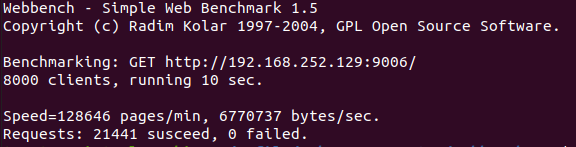

# MyWebServer
> 用C++实现的高性能Web服务器
## 功能
* 利用IO复用技术Epoll与线程池实现多线程的Reactor高并发模型；
* 利用正则与状态机解析HTTP请求报文，实现处理静态资源的请求；
* 利用标准库容器封装char，实现自动增长的缓冲区；
* 基于小根堆实现的定时器，关闭超时的非活动连接；
* 利用单例模式与阻塞队列实现异步的日志系统，记录服务器运行状态；
* 利用RAII机制实现了数据库连接池，减少数据库连接建立与关闭的开销，同时实现了用户注册登录功能。

## 环境

* Linux 20.04
* C++ 14
* Mysql

## 代码目录

```
.
├── buffer
│   ├── buffer.cpp
│   └── buffer.h
├── http
│   ├── httpconn.cpp
│   ├── httpconn.h
│   ├── httprequest.cpp
│   ├── httprequest.h
│   ├── httpresponse.cpp
│   └── httpresponse.h
├── log
│   ├── blockqueue.cpp
│   ├── blockqueue.h
│   ├── log.cpp
│   └── log.h
├── main.cpp
├── pool
│   ├── sqlconnpool.cpp
│   ├── sqlconnpool.h
│   ├── sqlconnRAII.h
│   └── threadpool.h
├── server
│   ├── epoller.cpp
│   ├── epoller.h
│   ├── webserver.cpp
│   └── webserver.h
└── timer
    ├── timer.cpp
    └── timer.h
```

## Mysql安装

```shell
sudo apt install mysql-server
sudo apt install mysql-client
sudo apt install libmysqlclient-dev
```

## 建立数据库

```shell
#登陆mysql
mysql -u root -p 

#建立你的数据库
create database yourdb;

#创建user表
USE yourdb;
CREATE TABLE user{ useranme char(50) NULL, passwd char(50) NULL}ENGINE=InnoDB;

#添加数据
INSERT INTO user(username, passwd) VALUES('name', 'passwd');
```

## 启动服务器

``` shell
make
./bin/server
```

## 压力测试

```shell
cd ./webbench-1.5/ && make
./webbench -c 8000 -t 10 http://ip:port/
```

压力测试结果



